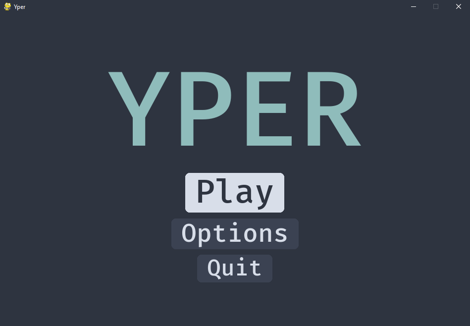

<br />
<p align="center">
    

  <h1 align="center">YPER</h1>
  <p align="center">
    Test your typing skills with Yper
  </p>
</p>

<!-- TABLE OF CONTENTS -->

## Table of Contents

- [About the Project](#about-the-project)
- [Getting Started](#getting-started)
  - [Prerequisites](#prerequisites)
  - [Installation](#installation)
- [Contributing](#contributing)
- [Contact](#contact)

<!-- ABOUT THE PROJECT -->

## About The Project

There are many great README templates available on GitHub, however, I didn't find one that really suit my needs so I created this enhanced one. I want to create a README template so amazing that it'll be the last one you ever need.

Here's why:

- Your time should be focused on creating something amazing. A project that solves a problem and helps others
- You shouldn't be doing the same tasks over and over like creating a README from scratch
- You should element DRY principles to the rest of your life :smile:

Of course, no one template will serve all projects since your needs may be different. So I'll be adding more in the near future. You may also suggest changes by forking this repo and creating a pull request or opening an issue.

A list of commonly used resources that I find helpful are listed in the acknowledgements.

<!-- GETTING STARTED -->

## Getting Started

### Prerequisites

To play Yper you'll need

- Python **3.x**
- Pygame **2**

```sh
python -m pip install pygame==2.0.0.dev12
```

### Installation

1. Clone or download the repository
2. Run the **main** script

```sh
git clone https://github.com/davidsongoap/yper.git
cd yper
python main.py
```

<!-- CONTRIBUTING -->

## Contributing

Any contribution to Yper is greatly appreciated.

1. Fork the Project
2. Create your Feature Branch (`git checkout -b feature/AmazingFeature`)
3. Commit your Changes (`git commit -m 'Add some AmazingFeature'`)
4. Push to the Branch (`git push origin feature/AmazingFeature`)
5. Open a Pull Request

<!-- CONTACT -->

## Contact

Davidson Gonçalves - davisongoap@gmail.com

Project Link: [https://github.com/davidsongoap/yper](https://github.com/davidsongoap/yper)
