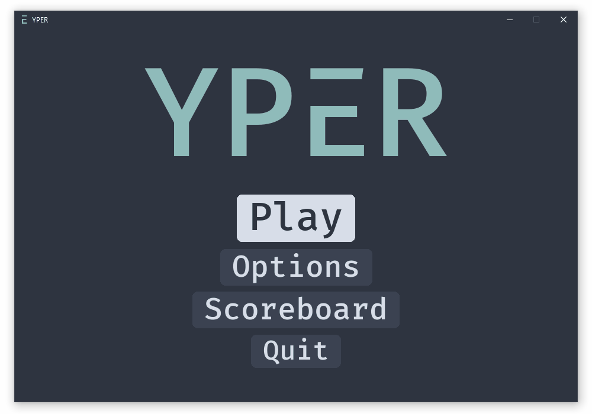

<br />
<p align="center">
    

  <h1 align="center">YPER</h1>
  <p align="center">
    Test your typing skills with Yper
  </p>
</p>

<!-- TABLE OF CONTENTS -->

## Table of Contents

- [How To Play](#how-to-play)
- [Getting Started](#getting-started)
  - [Prerequisites](#prerequisites)
  - [Installation](#installation)
- [Contributing](#contributing)
- [Contact](#contact)

<!-- ABOUT THE PROJECT -->

## How To Play

_Yper_ is a typing game written in python using the [Pygame](https://www.pygame.org/) Module

The objective is to type the words shown as quickly as you can. You can only start writting the next once you've typed **every character** of the current word correctly.

At the end you'll be presented with your calculated WPM (Words Per Minute) and Accuracy

<!-- GETTING STARTED -->

## Getting Started

### Prerequisites

To play Yper you'll need

- Python **3.x**
- Pygame **2**

```sh
python -m pip install pygame==2.0.0.dev12
```

### Installation

1. Clone or download the repository
2. Run the **main** script

```sh
git clone https://github.com/davidsongoap/yper.git
cd yper
python main.py
```

<!-- TODO -->

## TODO

- Change game settings on the options menu
- Text that makes sense

<!-- CONTRIBUTING -->

## Contributing

Any contribution to Yper is greatly appreciated.

1. Fork the Project
2. Create your Feature Branch (`git checkout -b feature/AmazingFeature`)
3. Commit your Changes (`git commit -m 'Add some AmazingFeature'`)
4. Push to the Branch (`git push origin feature/AmazingFeature`)
5. Open a Pull Request

<!-- CONTACT -->

## Contact

Davidson Gonçalves - davisongoap@gmail.com

Project Link: [https://github.com/davidsongoap/yper](https://github.com/davidsongoap/yper)
